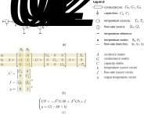
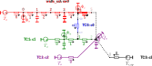

# Summary

State-space representation is widely used in the synthesis and analysis of dynamic systems, with applications particularly in control engineering. However, existing simulation tools often do not find the state-space representation. Dynamic Models for Building Energy Management ([dm4bem](dm4bem.py)) is a Python module that offers an innovative methodology for modelling heat and mass transfer using weighted directed graphs, also known as thermal circuits or networks. The methodology allows assembling the circuits to obtain complex models from constituent elements, and then transforming them into state-space representation. This representation provides several advantages, including the ability to analyse the eigenvalues of the transfer matrix, perform numerical integration for simulation, and synthesize control algorithms. Nonlinear models can be dealt with through linearization at each time step. This procedure is presented in this interactive book in which the code and tutorials can be run online.

## Why another dynamic thermal simulation tool?

Building energy management can significantly contribute to lower building consumption ([Van Thillo, Verbeke, & Audenaert, 2022](https://doi.org/10.1016/j.rser.2022.112099)). In this context, modeling and simulating heat and mass transfer play a crucial role in understanding and optimizing building energy performance. Traditionally, building dynamic thermal simulation software, such as [TRNSYS](https://www.trnsys.com), [EnergyPlus](https://energyplus.net), [IDA ICE](https://www.equa.se/en/ida-ice), [COMFIE](https://www.ces.minesparis.psl.eu/Logiciels/COMFIE/) & [PLEIADES](https://www.izuba.fr/logiciels/), [KoZiBu](http://www.jnlog.com/kozibu1_en.htm), rely on iterative solving of balance equations that couple models of different constituent elements. This approach does not provide a state representation of the system, limiting the analysis and synthesis of control systems. State-space representation can be obtained by using plateformes such as [MATLAB/Simulink](https://mathworks.com/products/simulink.html). Another characteristic of current software is that they use a graphical interface, which facilitates building design but makes reproducibility difficult. Finally, current solutions use proprietary software components. These software are adapted and largely used for building design and energy performance simulation.

The method and the Python module [dm4bem](dm4bem.py) (Dynamic Models for Building Energy Management) offer an innovative approach to modeling heat and mass transfer in buildings with application to control engineering. Unlike traditional coupling methods, thermal models in [dm4bem](dm4bem.py) are obtained by assembling. This approach has the advantage of providing a single model instead of several separate coupled models. Furthermore, thermal circuits are transformed into state representation, opening up new perspectives for analysis and synthesis of control systems for building energy management. The module, written in Python, is open-source and free to use.

## Features of _dm4bem_ method

The modeling in [dm4bem](dm4bem.py) utilizes thermal networks (or thermal circuits), which are weighted directed graphs (Figure 1) where:

- Nodes (or vertices) represent homogeneous temperatures, $\theta$, of geometric points (0D), lines (1D), surfaces (2D), or volumes (3D).
- Directed links (or edges) represent heat flow rates, $q$, between temperature nodes.

> Figure 1. Basic thermal network.

> Figure 2. Obtaining the system of differential-algebraic equations from a thermal network: a) General framework. b) Temperature differences. c) Flow rates (constitutive laws). d) Energy balance.

> Figure 3. Example of differential-algebraic system of equations for a thermal network: a) Thermal network. b) Matrices and vectors. c) Differencial-algebraic equations (DAE).

Thermal circuits are a visual representation of [constitutive laws](https://en.m.wikipedia.org/wiki/Constitutive_equation) and [energy balance equations](https://en.m.wikipedia.org/wiki/Conservation_of_energy) (Figure 2 c and d, respectively). Mathematical models, in the form of differential-algebraic equations, are obtained from the thermal circuits using the methodology presented in Figure 2a. An example is provided in Figure 3.

## Data structures

### Thermal circuit
The `dm4bem` method proposes a specific data structure: the thermal circuit (TC). It consists of a [dictionary](https://docs.python.org/3/tutorial/datastructures.html#dictionaries) composed of (Figure 3b):

- $A$: branch (flow rate) - node (temperature) incidence matrix;
- $G$: vector representing the diagonal of the conductance matrix;
- $C$: vector representing the diagonal of the capacitance matrix;
- $b$: vector containing the names of temperature sources on the branches;
- $f$: vector containing the names of flow rate sources in the nodes;
- $y$: vector indicating the temperature nodes considered as outputs.

These vectors and matrices allow writing a system of differential-algebraic equations (Figure 2 and Figure 3):

$$C \dot\theta = -A^T G A \theta + A^T G b + f$$

Once the system of differential-algebraic equations has been solved for temperatures $\theta$, the flow-rates $q$ are determined:

$$ q = G(-A \theta + b)$$

Thermal circuits can be built in Python or specified in a `.csv` file.

### State-space representation
The [state-space representation](https://en.m.wikipedia.org/wiki/State-space_representation) is obtained by eliminating the algebraic equations from the system of differential-algebraic equations, i.e., by considering only the nodes with capacitances in the thermal circuit ([Ghiaus, C. 2013](https://doi.org/10.1016/j.energy.2012.10.024)). It contains:
- $A_s$: state matrix;
- $B_s$: control matrix;
- $C_s$: observation matrix;
- $D_s$: direct action matrix;
- $u_s$: correspondence table between branches & nodes with sources and their names, i.e., the list of non-zero elements of vectors $b$ and $f$, as well as their respective positions in these vectors.

### Information on walls and building
For buildings, walls represent a frequent thermal model. The description of the walls is provided in a directory that contains two types of files:
- _Wall types_: thermo-physical properties of materials.
- _Wall data_: surface area, temperature and flow rate sources, convection and radiation coefficients of surfaces.

From this information, the thermal circuit of a wall is obtained (the matrices and vectors $A, G, C, b, f, y$).

A building can be described in a [directory (or folder)](https://github.com/cghiaus/dm4bem_toy_model/tree/main/bldg) containing:
- Walls ([wall types](./pd/bldg/wall_types.csv) and [walls data](./pd/bldg/walls_out.csv)) noted as `ow0` in Figure 4.
- Thermal circuits noted as [TC0](./pd/bldg/TC0.csv), [TC1](./pd/bldg/TC1.csv), [TC2](./pd/bldg/TC2.csv), [TC3](./pd/bldg/TC3.csv) in Figure 4.
- The assembly [matrix](./pd/bldg/assembly_matrix.csv)  or [lists](./pd/bldg/assembly_lists.csv) indicating the nodes that merge (connected by dashed lines in Figure 4).

## Algorithms
There are two significant algorithms: thermal circuit assembly and conversion of thermal circuits into state representation.

### Assembly

A set of disassembled thermal circuits is assembled into a single thermal circuit (Figure 4). Assembling can be performed by using an assembly matrix or assembly lists. The assembly matrix indicates two nodes to merge. For example, in Figure 4, node 0 of circuit c2 (in purple) merges with node 5 of circuit ow0 (the second node will no longer exist after the merger). The assembly list indicates the node that is kept after merging, for example, node 0 of circuit c2, and a list of nodes that merge, for example, node 5 of circuit ow0 and node 2 of circuit c1. The assembly matrix and lists are in a [directory (or folder)](https://github.com/cghiaus/dm4bem_toy_model/tree/main/bldg) describing the building.

> Figure 4. Assembling four circuits.

### Transformation of thermal circuit into state representation

By eliminating the algebraic equations, the system of differential-algebraic equations can be transformed into state representation ([Ghiaus, C. 2013](https://doi.org/10.1016/j.energy.2012.10.024)).

## Workflow

> Figure 5. Workflow for building simulation by using `dm4bem` module. The `dm4bem` functions are in bold letters.

The [workflow](https://en.m.wikipedia.org/wiki/Workflow) for modeling and simulation with [dm4bem](dm4bem.py) is (Figure 5):

- __Modelling:__ obtain the thermal circuit and the state-space representation.
    - Draw the thermal network based on the description of the building and on modelling assumptions.
    - Calculate the parameters of the thermal network: conductances and capacities.
    - Write the matrices and vectors ($A, G, C, b, f, y$) of the differential algebraic equations.
    - Create the thermal circuit __TC__ and convert it to state-space representation (matrices $A_s, B_s, C_s, D_s$ and input vector $u_s$).

- __Tests in steady-state and step respose:__ test if the model is wrong ([falsifiability](https://en.wikipedia.org/wiki/Falsifiability)). If the model fails these tests, then it is wrong; if the model passes these tests, it does not mean it is correct.
    - Compare and interpret the steady-state results obtained for thermal circuit and state-space representation.
    - Perform eigenvalue analysis of the state matrix $A_s$ of the state-space representation and analyse the maximum time step (for numerical integration with [Euler explicit or forward method](https://en.wikipedia.org/wiki/Euler_method)) and the [settling time](https://en.wikipedia.org/wiki/Settling_time). If the maximum time step is:
        - too small: set to zero the capacities which, with the related conductance (or resistance), produce the small time step (e.g., air, windows, doors);
        - too large: consider thiner discretization of elements which have large capacities (e.g., walls, ground).
    - Simulate the time response (by using [Euler explicit and implicit method](https://en.wikipedia.org/wiki/Explicit_and_implicit_methods)) to different [step inputs](https://en.wikipedia.org/wiki/Step_response).
    - Compare the settling time obtained from simulation of step response with that obtained by eigenvalue analysis.
    - Compare the steady-state value obtained by simulation of the models (thermal circuit and state-space representation).

- __Inputs:__ prepare the input data set, i.e., time variation of weather and scheduled sources of temperature and flow-rate.
    - Read the weather data (outdoor temperature, direct solar irradiance and diffuse solar irradiace).
    - Calculate the solar irradiance on the outdoor and indoor surfaces of the walls.
    - Define the schedules for temperature sources (e.g., indoor temperature set point) and flow rate sources (e.g., internal gains).
    - Obtain the input data set.

- __Simulation:__ integrate in time the model for the given inputs.
    - Transform the input data set into input vector in time for state-space representation.
    - Set the initial conditions.
    - Integrate the states in time (e.g., by using [Euler forward](https://en.wikipedia.org/wiki/Euler_method) and/or [backward](https://en.wikipedia.org/wiki/Backward_Euler_method) methods).
    - Calculate the outputs from the states.
    - Plot the results.

(An [example of implementation](https://github.com/cghiaus/dm4bem_toy_model/blob/main/pd05simulation.py#L38) for the thermal network from Figure 4).

## Conclusion

Dynamic Models for Building Energy Management ([dm4bem](dm4bem.py)) method offers an efficient approach to obtaining thermal models by assembling different models. The main contributions of the method lie in the following aspects:

- Definition of a data structure describing thermal circuits as weighted directed graphs, described by matrices and vectors $A, G, C, b, f, y.$
- Considering, in the state representation $A_s, B_s, C_s, D_s, u_s,$ the correspondence table $u_s$ between the non-zero elements of vectors $b$ and $f$ and the names of temperature and flow rate sources, respectively.
- Assembly of thermal circuits by merging temperature nodes, which requires transformation of matrices and vectors $A, G, C, b, f, y.$
- Transformation of the thermal circuit (directed weighted graph) into state-space representation.
- Procedure for generating thermal circuits for walls (generic, exterior, and interior).
- Folder structure allowing characterization of a building based on the description of walls, thermal circuits, and assembly matrix, and the procedure for creating the thermal circuit.
- Implementation of these concepts in Python and their explanation in Jupyter notebook tutorials.

By transforming thermal circuits into state representations, this method enables their use in the analysis and synthesis of control algorithms. Eigenvalue analysis of the state matrix provides important information about integration time step and response time, as well as proper choices in spatial discretization. By integrating non-linearities into the time integration loop, it is possible to model non-linear control parameters and/or algorithms. The method `dm4bem` uses text-based commands and model descriptions, facilitating reproducibility.

The current main drawback is that buildings are not described by using Computer-Aided Design (CAD) tools, which would enable automatic irradiance calculations. Another improvement would be to use sparse matrices to reduce memory usage. 

## References

- [Ghiaus, C. (2013)](https://doi.org/10.1016/j.energy.2012.10.024). Causality issue in the heat balance method for calculating the design heating and cooling loads, *Energy* 50: 292-301, [hal-03605823](https://hal.archives-ouvertes.fr/hal-03605823/document)
- [Van Thillo, L., Verbeke, S., & Audenaert, A. (2022)](https://doi.org/10.1016/j.rser.2022.112099). The potential of building automation and control systems to lower the energy demand in residential buildings: A review of their performance and influencing parameters. Renewable and Sustainable Energy Reviews, 158, 112099.
