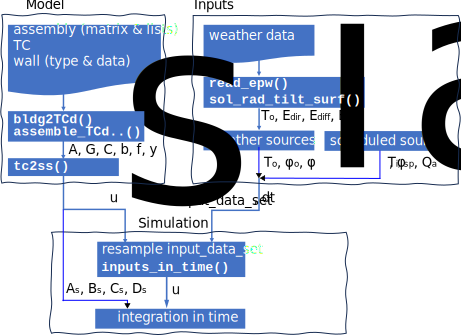

# Assembling thermal circuits

The [workflow](https://en.m.wikipedia.org/wiki/Workflow) for thermal analysis by using [dm4bem](dm4bem.py) module is presented in Figure 1:

- Model:
    - given data on walls (type and data on surfaces), thermal circuits and the assembling lists or matrix;
    - obtain the matrices and vectors of the thermal circuit $A, G, C, b, f, y$:
        - convert a folder containing the files characterizing the building into
    a disassambled thermal circuit (function `bldg2TCd()`);
        - assemble the thermal circuits (functions `assemble_TCd_matrix()` and `assemble_lists2matrix()`);
    - transform the thermal circuit into state-space representation $A_s, B_s, C_s, D_s, u_s$ (function `tc2ss()`).


- Inputs:
    - given the [Typical Meteorological Years (TMY)](https://en.m.wikipedia.org/wiki/Typical_meteorological_year) in EnergyPlus format `.epw`; 
    - read weather data: outdoor temperature, $T_o,$ and solar radiation (direct, $E_{dir},$ and diffuse, $E_{diff}$) with function `read_epw()` and calculate the solar radiation on tilted surfaces with function `sol_rad_tilt_surf()`;
    - determine the weather sources outdoor temperarure, $T_o,$ and solar radiation absorbed by the outdoor wall, $\Phi_o,$ the indoor wall, $\Phi_o,$ and the glass, $\Phi_a.$  
    - define the other inputs, such as indoor temperature set points, $T_{i,sp},$ auxiliary flow-rates, $\dot Q_a.$

- Simulation:
    - prepare the inputs from input description of the state-space,  $u_s,$ and the _input data set_ with function `inputs_in_time()`;
    - integrate in time by using Euler explicit and/or implicit methods.



> Figure 1. Workflow for building simulation by using `dm4bem` module (see [an example](https://github.com/cghiaus/dm4bem_toy_model)).